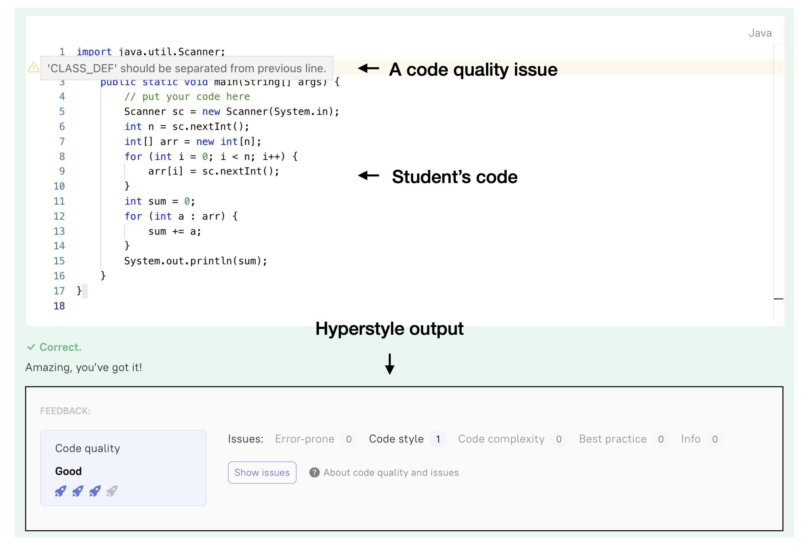

# Hyperstyle analysis

This repository contains several tools-helpers to work with data from the Hyperstyle platform:

- [core](./core) module contains some common functions like pandas utilities or some common models
- [templates](./templates/README.md) module contains algorithms for searching code quality issues in the pre-written templates.
- [data collection](./data_collection/README.md) module contains client for Hyperskill. This module use platforms' APIs to extract information about following entities from the educational platforms.
- [preprocessing](./preprocessing/README.md) module contains methods to preprocess and prepare data, collected from Hyperskill educational platform, for further analysis.

### JetBrains Academy/Hyperskill platform

On the JetBrains Academy platform, the educational process is structured as follows: firstly,
the student’s solution is checked for correctness using traditional predefined tests. Then, two
scenarios are possible:

**(1)** if the solution is incorrect (contains compilation errors or does not pass all tests), 
then these problems are reported to the student, and they continue to solve the
task;

**(2)** if the solution is correct, the [Hyperstyle](https://github.com/hyperskill/hyperstyle) tool is launched to check the quality of the code.

Therefore, the result of the Hyperstyle tool can only be determined for _correct_ solutions,
that is, solutions that pass all tests. After successfully passing the solution, the student receives
a code quality grade on a four-point scale, and all detected issues (if any) are highlighted in
the code editor. An example of the Hyperstyle user interface:

### Getting started

This project uses the [Paddle](https://github.com/JetBrains-Research/paddle#tasks-section) build system. To set up the project you need:
1. Clone this repository
2. Install the [Paddle](https://plugins.jetbrains.com/plugin/17452-paddle) plugin
3. Open the repository in the [PyCharm](https://www.jetbrains.com/pycharm/) IDE
4. Import this project as a Paddle project

Each module contains Paddle tasks to configure and run it. Read more in README files in the modules.

Also, each module contains tests that run the entry points of the module. These tests are called with `test_run` prefix. You can see these tests to see the format of the arguments and the input data.