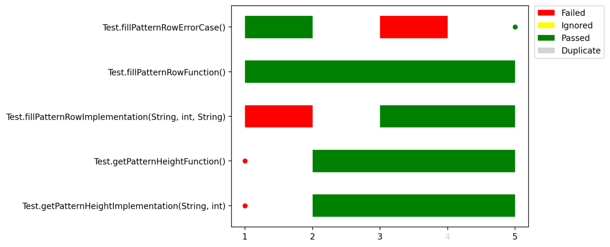
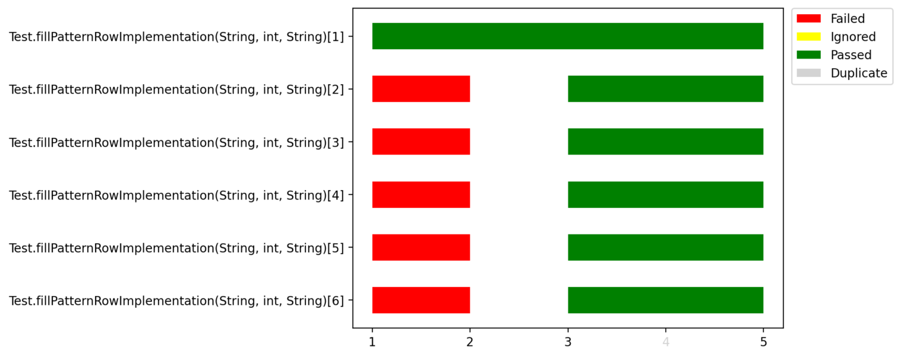

## Description

This module contains utilities to analyze data from JetBrains Marketplace.

----

# Preprocess data

[This module](src/processing) contains script to preprocess row data to perform further analysis.

1. [prepare_course_data.py](src/processing/prepare_course_data.py) allows you to filter 
data by the course id and also to collect information about the course structure.

### Usage

Execute one of the following commands with necessary arguments:
```bash
poetry run prepare_course_data [arguments]
```
or
```bash
docker run hyperstyle-analysis-prod:<VERSION> poetry run prepare_course_data [arguments]
```

**Required arguments**:

- `data_path` — Path to .csv file with collected data. The file must contain the following columns: `task_id`, `course_id`, `submission_datetime`, `status`, `task_type`, `user_id`, `task_name` (see [an example](tests/resources/processing/all_data.csv) in the tests).
- `course_id` — Course id to analyze.
- `course_sources_path` — Path to course sources to extract course structure (see [an example](tests/resources/processing/course_example) in the tests).

After this step you will get a new file with `courseId` suffix. This file will contain all data from the `data_path` file, but only for the course with the course id `course_id`.
Also, an additional file with the course structure will be generated, e.g. for the [course](tests/resources/processing/course_example) from the test folder with the following structure:
```text
- course_root
-- course-info.yaml
-- course-remote-info.yaml
-- section
--- section-info.yaml
--- section-remote-info.yaml
--- lesson
---- lesson-info.yaml
---- lesson-remote-info.yaml
---- task1
----- task-info.yaml
----- task-remote-info.yaml
---- task2
----- task-info.yaml
----- task-remote-info.yaml
```

the [following](tests/resources/processing/course_1_structure_expected.csv) file will be generated.

2. [data_processing.py](src/processing/data_processing.py) allows you to process data from the previous step:
- Merge course data with task info
- Add submission group
- Add submission attempt

### Usage

Execute one of the following commands with necessary arguments:
```bash
poetry run process_course_data [arguments]
```
or
```bash
docker run hyperstyle-analysis-prod:<VERSION> poetry run process_course_data [arguments]
```

**Required arguments**:

- `course_data_path` — Path to .csv file with preprocessed data by [data_processing.py](src/processing/data_processing.py).
- `course_structure_path` — Path to .csv file with the course structure gathered by [prepare_course_data.py](src/processing/prepare_course_data.py).

After this step you will get a new file with course data with `courseId_preprocessed` suffix. 

----

# Analyze data

[This module](src/plots) allows you to visualize the data to perform further analysis.

1. [task_solving.py](src/plots/task_solving.py) allows you to plot line charts how students solve tasks from the course.

Execute one of the following commands with necessary arguments:
```bash
poetry run plot_task_solving [arguments]
```
or
```bash
docker run hyperstyle-analysis-prod:<VERSION> poetry run plot_task_solving [arguments]
```

**Required arguments**:

- `preprocessed_course_data_path` — Path to .csv file with preprocessed data by [data_processing.py](src/processing/data_processing.py).
- `course_structure_path` — Path to .csv file with the course structure gathered by [prepare_course_data.py](src/processing/prepare_course_data.py).

Optional arguments:

| Argument                            | Description                                 |
|-------------------------------------|---------------------------------------------|
| **&#8209;&#8209;course&#8209;name** | Name of the course to display on the chart. |


2. [task_attempt.py](src/plots/task_attempt.py) allows you to plot line charts how many attempts students spend to solve the tasks from the course.

Execute one of the following commands with necessary arguments:
```bash
poetry run plot_task_attempt [arguments]
```
or
```bash
docker run hyperstyle-analysis-prod:<VERSION> poetry run plot_task_attempt [arguments]
```

**Required arguments**:

- `preprocessed_course_data_path` — Path to .csv file with preprocessed data by [data_processing.py](src/processing/data_processing.py).
- `course_structure_path` — Path to .csv file with the course structure gathered by [prepare_course_data.py](src/processing/prepare_course_data.py).

**Optional arguments**:

| Argument                            | Description                                 |
|-------------------------------------|---------------------------------------------|
| **&#8209;&#8209;course&#8209;name** | Name of the course to display on the chart. |

3. [task_duplicates.py](src/plots/task_duplicates.py) allows you to plot line charts how many duplicate submissions students sent during tasks solving.

Execute one of the following commands with necessary arguments:
```bash
poetry run plot_task_duplicates [arguments]
```
or
```bash
docker run hyperstyle-analysis-prod:<VERSION> poetry run plot_task_duplicates [arguments]
```

**Required arguments**:

- `preprocessed_course_data_path` — Path to .csv file with preprocessed data by [data_processing.py](src/processing/data_processing.py).
- `course_structure_path` — Path to .csv file with the course structure gathered by [prepare_course_data.py](src/processing/prepare_course_data.py).

**Optional arguments**:

| Argument                            | Description                                 |
|-------------------------------------|---------------------------------------------|
| **&#8209;&#8209;course&#8209;name** | Name of the course to display on the chart. |

----

# Run tests

[This module](src/test_logs) allows you to run tests and parsed its output to perform further analysis.

**Note**: This module only works with courses that have a structure like in [Kotlin Onboarding](https://github.com/jetbrains-academy/kotlin-onboarding-introduction)!
This means that your task module name should have a specific format. For example, assume you have a task in the folder `Introduction/LastPush/CompleteTheProject`, 
then your module should be named `Introduction-LastPush-CompleteTheProject`

1. [tests_runner.py](src/test_logs/tests_runner.py) allows you to run tests via Gradle and save Gradle logs to perform further parsing.

Execute one of the following commands with necessary arguments:
```bash
poetry run gradle_tests_runner [arguments]
```
or
```bash
docker run hyperstyle-analysis-prod:<VERSION> poetry run gradle_tests_runner [arguments]
```

**Required arguments**:
- `submissions_path` — Path to .csv file with submissions.
- `course_sources_path` — Path to course sources.
- `logs_output_path` — Path to the folder to store logs.

**Optional arguments**:

| Argument                      | Description                                       |
|-------------------------------|---------------------------------------------------|
| **&#8209;&#8209;timeout**     | Timeout in seconds for subprocess to be executed. |
| **&#8209;&#8209;n&#8209;cpu** | Number of CPUs to use for parallel execution.     |
| **&#8209;&#8209;debug**       | Run the script in debug mode                      |


2. [logs_parser.py](src/test_logs/logs_parser.py) allows you to parse Gradle logs into json strings:
- Gradle exceptions will match the structure of the [`ExceptionData`](src/models/edu_logs.py) dataclass. For example:
  ```json
  {
    "path": "src/main/kotlin/Main.kt", 
    "line_number": 4, 
    "column_number": 9, 
    "message": "Conflicting declarations: val firstUserAnswer: String, val firstUserAnswer: String"
  }
  ```
- Gradle tests will match the structure of the [`TestData`](src/models/edu_logs.py) dataclass.
  ```json
  {
    "class_name": "Test", 
    "test": "testCountExactMatchesFunction()", 
    "method_name": "testCountExactMatchesFunction()", 
    "duration": "0s", 
    "result": "passed", 
    "error_class": null, 
    "message": null
  }
  ```

Execute one of the following commands with necessary arguments:
```bash
poetry run gradle_logs_parser [arguments]
```
or
```bash
docker run hyperstyle-analysis-prod:<VERSION> poetry run gradle_logs_parser [arguments]
```

**Required arguments**:
- `submissions_path` — Path to .csv file with submissions.
- `gradle_logs_path` — Path to a folder with gradle logs.

**Optional arguments**:

| Argument                | Description                  |
|-------------------------|------------------------------|
| **&#8209;&#8209;debug** | Run the script in debug mode |

3. [tests_analysis.py](src/test_logs/tests_analysis.py) allows you to visualize parsed test logs obtained from [logs_parser.py](src/test_logs/logs_parser.py).

Execute one of the following commands with necessary arguments:
```bash
poetry run streamlit run tests_analysis.py
```
or
```bash
docker run hyperstyle-analysis-prod:<VERSION> poetry run streamlit run tests_analysis.py
```

The command runs Streamlit app that show two Gantt Chart:
- General tests timeline.
  
- Parametrized tests timeline.
  
