# Description

This module contains utilities to analyze data from JetBrains Marketplace.

----

# Preprocess data

[This module](src/processing) contains a script to preprocess raw data to perform further analysis.

1. [collect_course_structure.py](src/processing/collect_course_structure.py) allows you to collect information about the
   course structure.

### Usage

Execute one of the following commands with necessary arguments:

```bash
poetry run collect_course_structure [arguments]
```

or

```bash
docker run hyperstyle-analysis-prod:<VERSION> poetry run collect_course_structure [arguments]
```

**Required arguments**:

- `course_sources_path` — Path to course sources to extract course structure.
- `output_path` — Path to .csv file where to save the course structure.

After this step you will get a new file with the course structure, e.g. for
the [course](tests/resources/processing/collect_course_structure/course_with_section) from the test folder with the
following structure:

```text
course-info.yaml
course-remote-info.yaml
section/
├── section-info.yaml
├── section-remote-info.yaml
└── lesson/
    ├── lesson-info.yaml
    ├── lesson-remote-info.yaml
    ├── task1/
    │   ├── task-info.yaml
    │   ├── task-remote-info.yaml
    │   ├── src/
    │   │   └── ...
    │   └── task.md
    ├── task2/
    │   ├── task-info.yaml
    │   ├── task-remote-info.yaml
    │   ├── task.md
    │   └── src/
    │       └── ...
    └── task3/
        ├── task-info.yaml
        ├── task-remote-info.yaml
        ├── task.md
        └── src/
            └── ...
```

the [following](tests/resources/processing/collect_course_structure/expected_course_with_section.csv) file will be
generated.

2. [data_processing.py](src/processing/data_processing.py) allows you to process data from the previous step:

- Merge course data with task info
- Add submission group
- Add submission attempt

### Usage

Execute one of the following commands with necessary arguments:

```bash
poetry run process_course_data [arguments]
```

or

```bash
docker run hyperstyle-analysis-prod:<VERSION> poetry run process_course_data [arguments]
```

**Required arguments**:

- `course_data_path` — Path to .csv file with preprocessed data
  by [data_processing.py](src/processing/data_processing.py).
- `course_structure_path` — Path to .csv file with the course structure gathered
  by [prepare_course_data.py](src/processing/prepare_course_data.py).

After this step you will get a new file with course data with `courseId_preprocessed` suffix.

3. [tasktracker_content_collector.py](src/processing/tasktracker_content_collector.py) collects data from the course
   into the tasktracker task content file format

### Usage

Execute one of the following commands with necessary arguments:

```bash
poetry run tasktracker_content_collector [arguments]
```

or

```bash
docker run hyperstyle-analysis-prod:<VERSION> poetry run tasktracker_content_collector [arguments]
```

**Required arguments**:

- `course_sources_path` — Path to course sources to extract course structure.
- `destination_path` — Path to directory where yaml file will be created.

4. [tasktracker_task_filter.py](src/processing/tasktracker_task_filter.py) filtering data by the start research date.
Grouping by package name.


### Usage

Execute one of the following commands with necessary arguments:


```bash
poetry run tasktracker_task_filter [arguments]
```

or


```bash
docker run hyperstyle-analysis-prod:<VERSION> poetry run tasktracker_task_filter [arguments]
```

**Required arguments**:

- `document_path` — Path to documentdata.csv.
- `destination_path` — Path of the file to save filtered data.
- `start_date` — Start of the research in the DD.MM.YYYY format.

5. [tasktracker_edu_validation.py](src/processing/tasktracker_edu_validation.py) Divide filtered tasktracker file to 2
files - the first with emails that have been presented in the edu csv file, and the second file without them.

### Usage

Execute one of the following commands with necessary arguments:

```bash
poetry run tasktracker_edu_validation [arguments]
```

or

```bash
docker run hyperstyle-analysis-prod:<VERSION> poetry run tasktracker_edu_validation [arguments]
```

**Required arguments**:

- `filtered_data` — Path to the data filtered by tasktracker_task_filter.
- `destination_path` — Path of the directory to save divided data.
- `users_file` — Tasktracker users.csv file.
- `researches_file` — Tasktracker researches.csv file.
- `edu_file` — Edu csv file.


4. [tasktracker_platform_step_mapping.py](src/processing/tasktracker_platform_step_mapping.py) determines the lesson 
and the task for TaskTracker records (if possible) by mapping with the data about submissions to the platform.

### Usage

Execute one of the following commands with necessary arguments:

```bash
poetry run tasktracker_platform_step_mapping [arguments]
```

or

```bash
docker run hyperstyle-analysis-prod:<VERSION> poetry run tasktracker_platform_step_mapping [arguments]
```

**Required arguments**:

- `tasktracker_file_path` — Path to .csv file with TaskTracker dataset.
- `platform_file_path` — Path to .csv file with platform dataset.
- `output_path` — Path to output directory where updated TaskTracker dataset will be saved.

----

# Simple general statistics

[This module](src/plots) allows you to visualize simple general data statistics to perform further analysis.

1. [task_solving.py](src/plots/task_solving.py) allows you to plot line charts how students solve tasks from the course.

   Execute one of the following commands with necessary arguments:
   ```bash
   poetry run plot_task_solving [arguments]
   ```
   or
   ```bash
   docker run hyperstyle-analysis-prod:<VERSION> poetry run plot_task_solving [arguments]
   ```

   **Required arguments**:

    - `preprocessed_course_data_path` — Path to .csv file with preprocessed data
      by [data_processing.py](src/processing/data_processing.py).
    - `course_structure_path` — Path to .csv file with the course structure gathered
      by [prepare_course_data.py](src/processing/prepare_course_data.py).

   Optional arguments:

   | Argument                            | Description                                 |
   |-------------------------------------|---------------------------------------------|
   | **&#8209;&#8209;course&#8209;name** | Name of the course to display on the chart. |


2. [task_attempt.py](src/plots/task_attempt.py) allows you to plot line charts how many attempts students spend to solve
   the tasks from the course.

   Execute one of the following commands with necessary arguments:
   ```bash
   poetry run plot_task_attempt [arguments]
   ```
   or
   ```bash
   docker run hyperstyle-analysis-prod:<VERSION> poetry run plot_task_attempt [arguments]
   ```

   **Required arguments**:

    - `preprocessed_course_data_path` — Path to .csv file with preprocessed data
      by [data_processing.py](src/processing/data_processing.py).
    - `course_structure_path` — Path to .csv file with the course structure gathered
      by [prepare_course_data.py](src/processing/prepare_course_data.py).

   **Optional arguments**:

   | Argument                            | Description                                 |
   |-------------------------------------|---------------------------------------------|
   | **&#8209;&#8209;course&#8209;name** | Name of the course to display on the chart. |

3. [task_duplicates.py](src/plots/task_duplicates.py) allows you to plot line charts how many duplicate submissions
   students sent during tasks solving.

   Execute one of the following commands with necessary arguments:
   ```bash
   poetry run plot_task_duplicates [arguments]
   ```
   or
   ```bash
   docker run hyperstyle-analysis-prod:<VERSION> poetry run plot_task_duplicates [arguments]
   ```

   **Required arguments**:

    - `preprocessed_course_data_path` — Path to .csv file with preprocessed data
      by [data_processing.py](src/processing/data_processing.py).
    - `course_structure_path` — Path to .csv file with the course structure gathered
      by [prepare_course_data.py](src/processing/prepare_course_data.py).

   **Optional arguments**:

   | Argument                            | Description                                 |
   |-------------------------------------|---------------------------------------------|
   | **&#8209;&#8209;course&#8209;name** | Name of the course to display on the chart. |

Charts plotted with this module can be found in [this section](#visualization).

----

# Test logs analysis

[This module](src/test_logs) allows you to run tests and parse its output to perform further analysis.

**Note**: This module only works with courses that have a structure like
in [Kotlin Onboarding](https://github.com/jetbrains-academy/kotlin-onboarding-introduction)!
This means that your task module name should have a specific format. For example, assume you have a task in the
folder `Introduction/LastPush/CompleteTheProject`,
then your module should be named `Introduction-LastPush-CompleteTheProject`

1. [tests_runner.py](src/test_logs/tests_runner.py) allows you to run tests via Gradle and save Gradle logs to perform
   further parsing.

   Execute one of the following commands with necessary arguments:
   ```bash
   poetry run gradle_tests_runner [arguments]
   ```
   or
   ```bash
   docker run hyperstyle-analysis-prod:<VERSION> poetry run gradle_tests_runner [arguments]
   ```

   **Required arguments**:
    - `submissions_path` — Path to .csv file with submissions.
    - `course_sources_path` — Path to course sources.
    - `logs_output_path` — Path to the folder to store logs.

   **Optional arguments**:

   | Argument                                         | Description                                                                 |
   |--------------------------------------------------|-----------------------------------------------------------------------------|
   | **&#8209;&#8209;timeout**                        | Timeout in seconds for subprocess to be executed.                           |
   | **&#8209;&#8209;n&#8209;cpu**                    | Number of CPUs to use for parallel execution.                               |
   | **&#8209;&#8209;force&#8209;ignore&#8209;tests** | Force to ignore substitution of test files if they are visible to the user. |
   | **&#8209;&#8209;debug**                          | Run the script in debug mode.                                               |
   | **&#8209;&#8209;script&#8209;logs&#8209;path**   | Path to a file where to save script logs.                                   |


2. [logs_parser.py](src/test_logs/logs_parser.py) allows you to parse Gradle logs into json strings:
    - Gradle exceptions will match the structure of the [`ExceptionData`](src/models/edu_logs.py) dataclass. For
      example:
      ```json
      {
        "path": "src/main/kotlin/Main.kt", 
        "line_number": 4, 
        "column_number": 9, 
        "message": "Conflicting declarations: val firstUserAnswer: String, val firstUserAnswer: String"
      }
      ```
    - Gradle tests will match the structure of the [`TestData`](src/models/edu_logs.py) dataclass.
      ```json
      {
        "class_name": "Test", 
        "test": "testCountExactMatchesFunction()", 
        "method_name": "testCountExactMatchesFunction()", 
        "duration": "0s", 
        "result": "passed", 
        "error_class": null, 
        "message": null
      }
      ```

   Execute one of the following commands with necessary arguments:
   ```bash
   poetry run gradle_logs_parser [arguments]
   ```
   or
   ```bash
   docker run hyperstyle-analysis-prod:<VERSION> poetry run gradle_logs_parser [arguments]
   ```

   **Required arguments**:
    - `submissions_path` — Path to .csv file with submissions.
    - `gradle_logs_path` — Path to a folder with gradle logs.

   **Optional arguments**:

   | Argument                | Description                  |
   |-------------------------|------------------------------|
   | **&#8209;&#8209;debug** | Run the script in debug mode |

Charts plotted with this module can be found in [this section](#visualization).

---

# Inspections analysis

[This module](src/inspections) allows you to gather IntelliJ inspections and also
contains functions that are necessary for their visualization.

[gathering.py](src/inspections/gathering.py) allows you to gather IntelliJ inspections.
Execute one of the following commands with necessary arguments:

```bash
poetry run inpsections_gathering [arguments]
```

or

```bash
docker run hyperstyle-analysis-prod:<VERSION> poetry run inpsections_gathering [arguments]
```

**Required arguments**:

- `submissions_path` — Path to .csv file with submissions.
- `--tool-path` — Path to the Hyperstyle entry point.
- `--language-version` — Language version of code snippets.
- `--host` — Code quality server address.
- `--port` — Code quality server port.

**Optional arguments**:

| Argument                                       | Description                                              |
|------------------------------------------------|----------------------------------------------------------|
| **&#8209;&#8209;venv**                         | Path to venv to run the tool.                            |
| **&#8209;&#8209;disable**                      | List of inspectors to disable. Example: `pylint,flake8`. |
| **&#8209;&#8209;debug**                        | Run the script in debug mode.                            |
| **&#8209;&#8209;script&#8209;logs&#8209;path** | Path to a file where to save script logs.                |

Charts plotted with this module can be found in [this section](#visualization).

---

# Visualization

[This module](src/visualization) contains [Streamlit](https://streamlit.io/) app that visualizes all statistics gathered
from students' submissions.

To run the app, you need to execute the following command:

```bash
poetry run streamlit run ./visualization/README.py
```

The app consists of several pages:

1. [README](src/visualization/README.py) contains an application description and input fields for common resources:
    1. Submissions path — Path to .csv file with submissions, parsed test logs and inspections.
    2. Course structure path — Path to .csv file with course structure.

2. [General stats](src/visualization/pages/1_General_stats.py) contains charts from
   the [Simple general statistics](#simple-general-statistics) module:
    - Task attempts:

      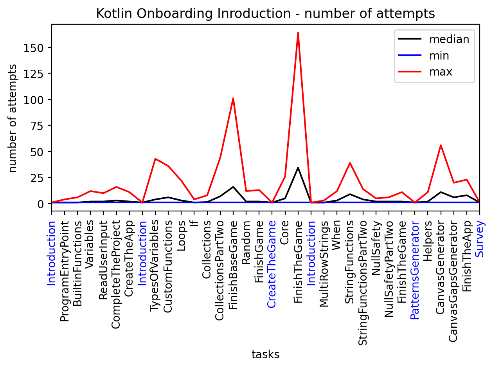

    - Task solving:

      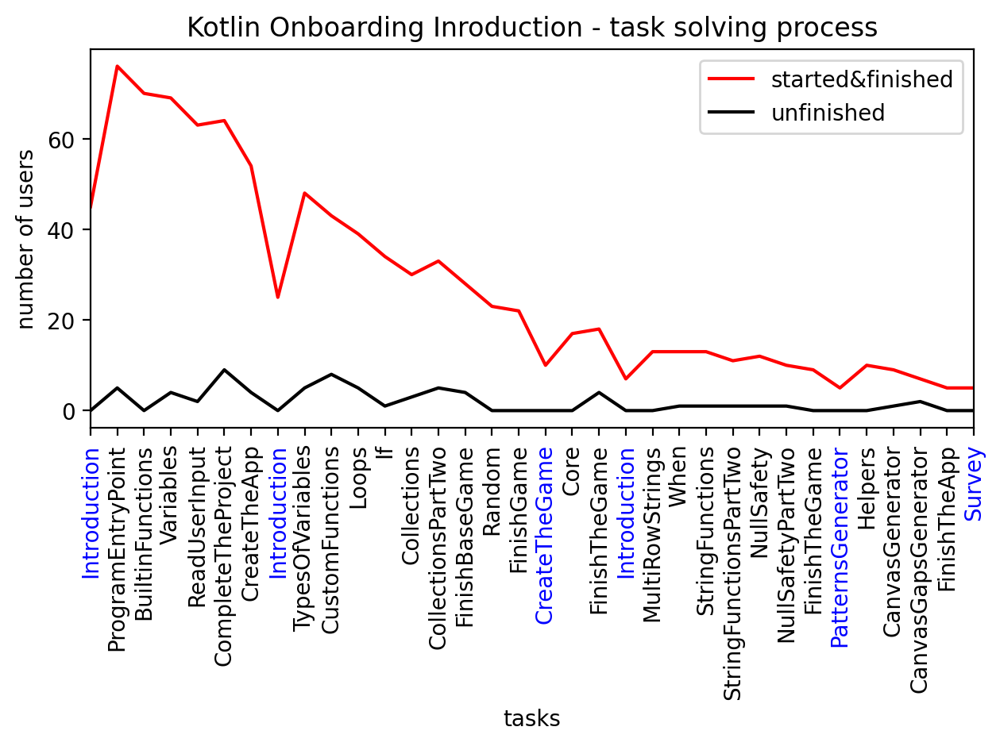

    - Task duplicates:

      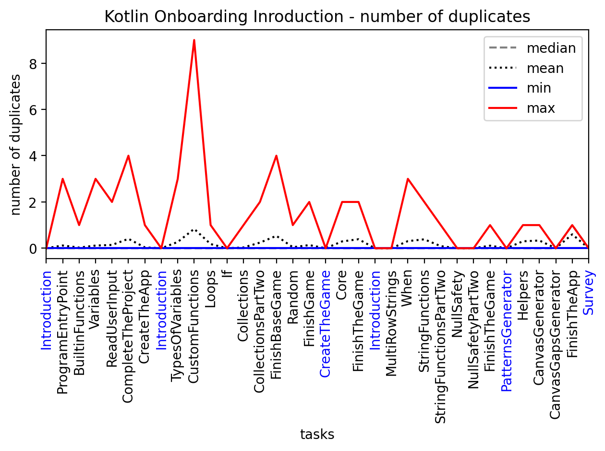

3. [Group tests timeline](src/visualization/pages/2_Group_tests_timeline.py) contains charts from
   the [Test logs analysis](#test-logs-analysis) module:
    - General tests timeline:

      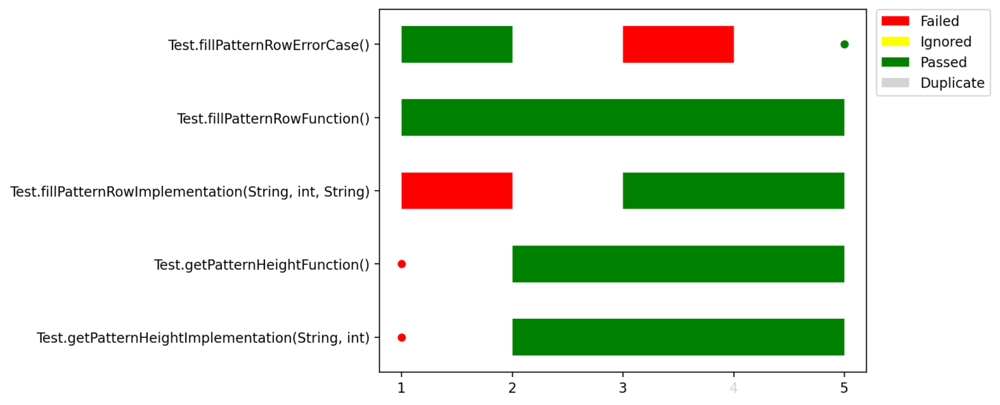

    - Parametrized tests timeline:

      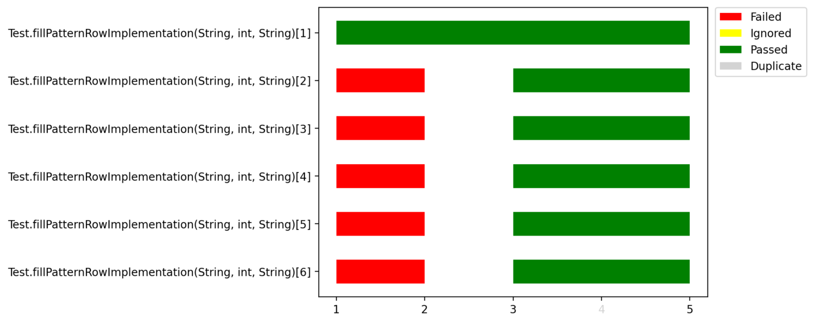

4. [Aggregated timeline stats](src/visualization/pages/3_Aggregated_timeline_stats.py) contains charts from
   the [Test logs analysis](#test-logs-analysis) module:
    - Average tests timeline:

      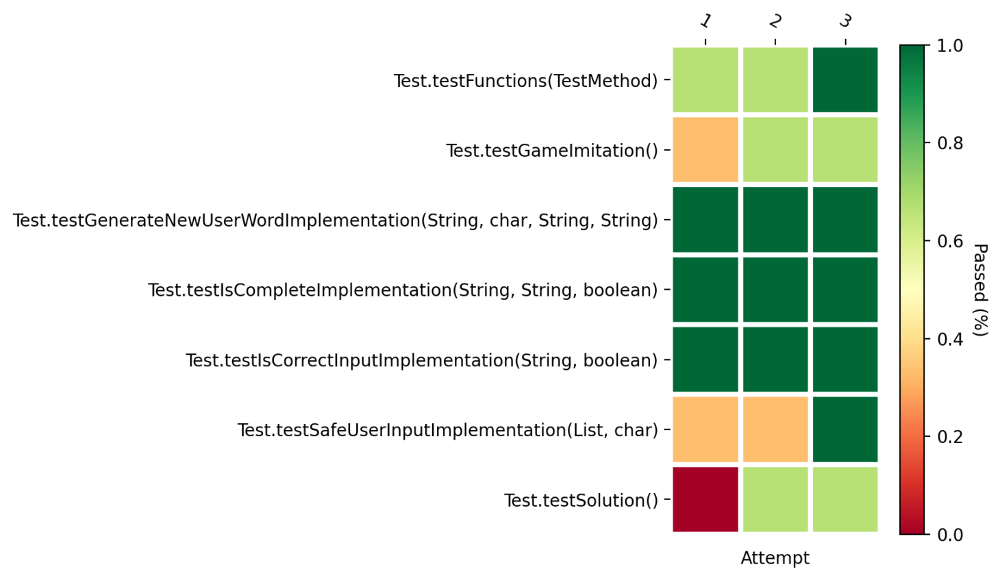

    - Tests chain:

      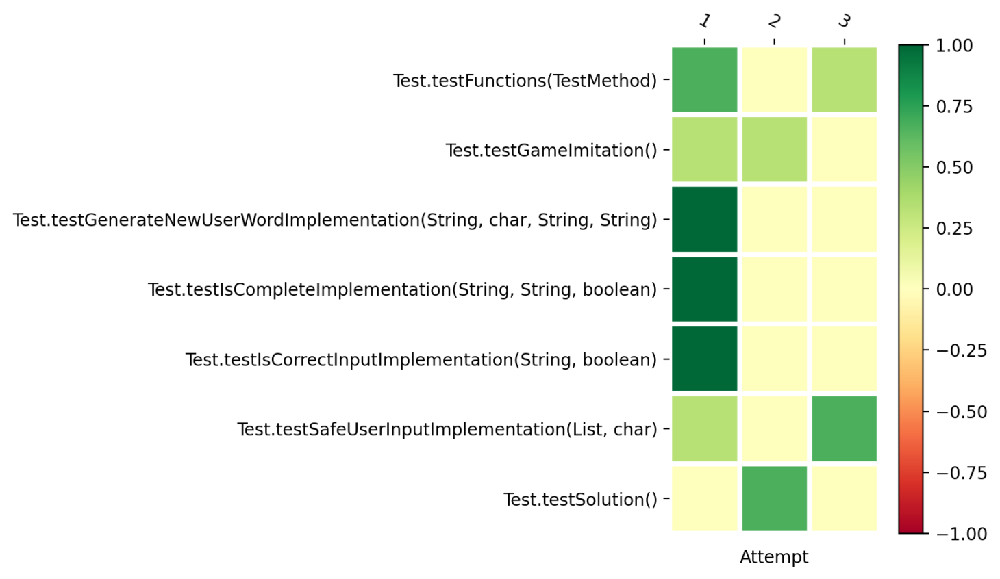

5. [Inspections stats](src/visualization/pages/4_Inspections_stats.py) contains charts from
   the [Inspections analysis](#inspections-analysis) module:
    - Inspections frequency:

      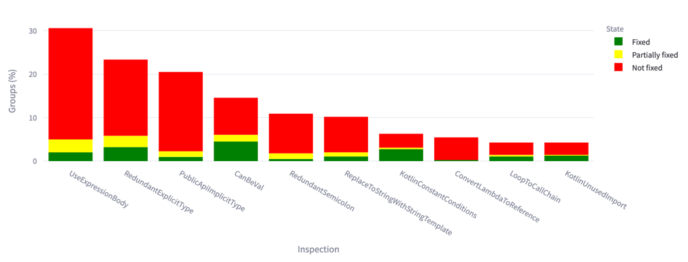

    - Inspections fixing examples:

      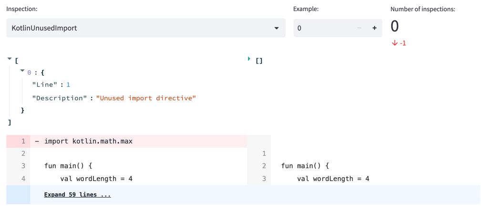

6. [Submissions viewer](src/visualization/pages/5_Submissions_viewer.py) allows you to view user submissions within some
   group.

   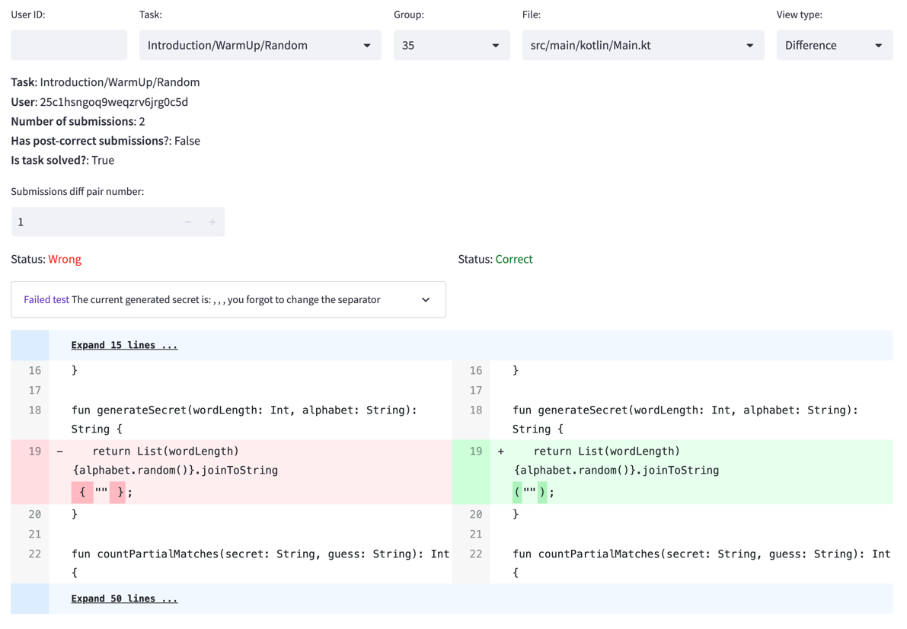

7. [Automated analysis](src/visualization/pages/6_Automated_analysis.py) allows you to automatically analyse
   submissions' data.

    - [Median attempts analysis](src/visualization/pages/automated_analysis/median_attempts_analysis.py)
      allows you to find suspicious tasks whose median number of attempts is not less than a threshold
      and view group submissions from these tasks.

      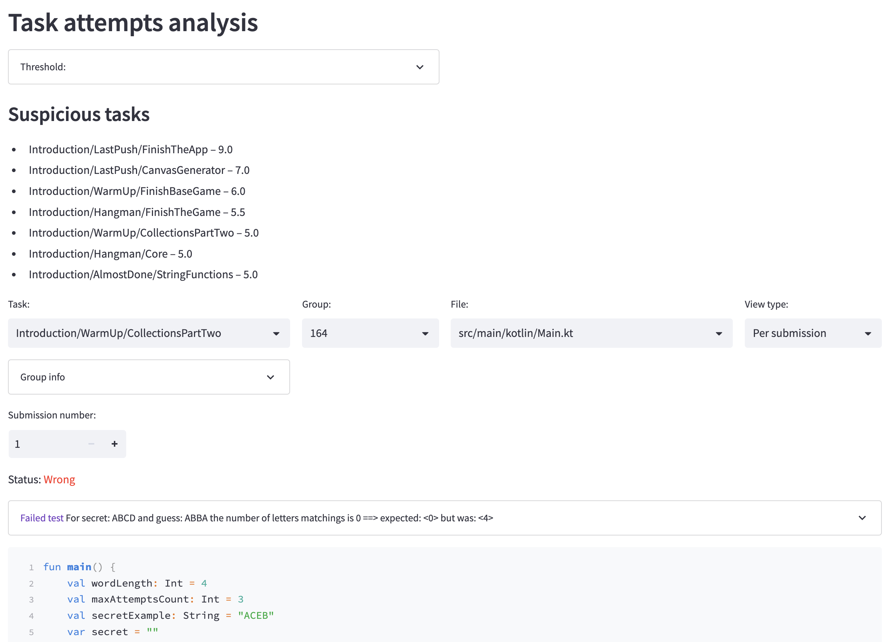

    - [Failed users analysis](src/visualization/pages/automated_analysis/failed_users_analysis.py)
      allows you to find suspicious tasks whose relative number of failed users is not less than a threshold
      and view group submissions from these tasks.

      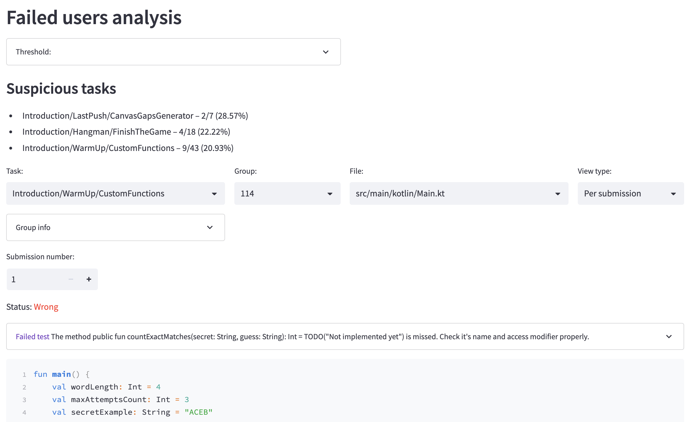

    - [Median test attempts analysis](src/visualization/pages/automated_analysis/median_test_attempts_analysis.py)
      allows you to find suspicious tests whose median number of attempts is not less than a threshold
      and view group submissions that contain these tests.

      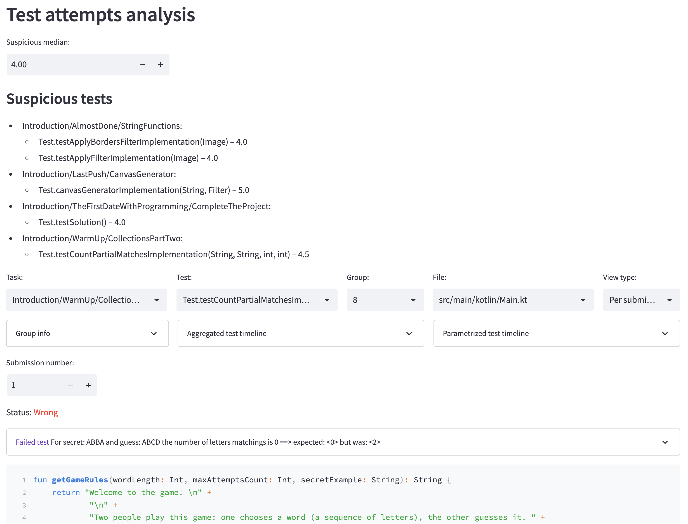