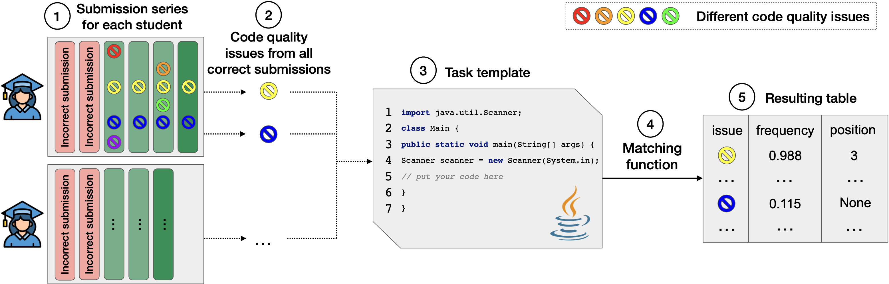

## Search template issues based on frequency

Firstly we need to indicate issues which remains in all submissions of concrete user for concrete step 
(which student do not during all attempts to pass step).

The algorithm pipeline is the following: 



The goal of our approach is to automatically detect code quality issues in pre-written task templates to help task creators detect and fix them.
Firstly, we run [Hyperstyle](https://github.com/hyperskill/hyperstyle) on solutions for problems containing a pre-written template (**1** in figure with pipeline), and then **2** only keep the issues that are present in all of the successful attempts.
This way, we focus on issues that the students did not fix and that could thus not be introduced by them.
Next, **3** we take the original template and **4** use a _matching function_  to match code quality issues from the student solutions to it. 
For each issue, we have the position in the solution (line number), which allows us to extract the student's code lines and compare them with the template.
After running this matching function, **5** we get the final table with the list of raw template issues.
Finally, it is possible to run a special converter to present the results in a user-friendly format. (see the **postprocessing** section)

### Usage

Run the script by one of the following way with the arguments:

Required arguments:

- `submissions_path` — Path to .csv file with submissions. The file must contain the following columns: `id`, `lang`, `step_id`, `code`, `group`, `attempt`, `hyperskill_issues`/`qodana_issues` (please, use [preprocess_submissions.py](../../../../preprocessing/src/preprocessing/preprocess_submissions.py) script to get  `group` and `attempt` columns).
- `steps_path` — Path to .csv file with steps. The file must contain the following columns: `id`, and `code_template` OR `code_templates`.
- `issues_column` — Column name in .csv file with submissions where issues are stored (can be `hyperstyle_issues` ot `qodana_issues`).

Optional arguments:

| Argument                                                     | Description                                                                                                                         |
|--------------------------------------------------------------|-------------------------------------------------------------------------------------------------------------------------------------|
| **&#8209;ic**, **&#8209;&#8209;ignore-trailing-comments**    | Ignore trailing (in the end of line) comments while comparing two code lines.                                                       |
| **&#8209;iw**, **&#8209;&#8209;ignore-trailing-whitespaces** | Ignore trailing whitespaces while comparing two code lines.                                                                         |
| **&#8209;equal**                                             | Function for lines comparing. Possible functions: `edit_distance`, `edit_ratio`, `substring`. The default value is `edit_distance`. |
| **&#8209;output-path**                                             | Path .csv file with repetitive issues search result. If no value was passed, the output will be printed into the console. |

#### From Docker

**TODO**

#### From Paddle

The [Paddle](https://github.com/JetBrains-Research/paddle#tasks-section) build system, you can use it to run this script:
- add arguments to the `filter_by_freq` task in the [paddle.yaml](../../../paddle.yaml) file:
```yaml
- id: search_by_freq
  entrypoint: templates/freq/search_template_issues.py
  args:
    - submissions_path
    - steps_path
    - issues_column
    - --ignore-trailing-comments [optional]
    - --ignore-trailing-whitespaces [optional]
    - -equal [optional]
    - edit_distance
```
Next you just need to run this task.

#### From CLI

Run the [search_template_issues.py](search_template_issues.py) script with the arguments from command line.

### Output format

Example for **output** csv with repetitive issues:
  - `step_id` - id of step where repetitive issue found
  - `name` - issue name
  - `description` - the message about this issue which student see
  - `pos_in_template` - position of issue in template code (can be null if not detected)
  - `line` - example of line of code where repetitive issue is detected
  - `frequency` - % of submission series with such repetitive issue
  - `count` - number of submission series with such repetitive issue
  - `total_count` - number of all submission series for such step
  - `groups` - ids of submission series (groups) with such repetitive issue


| step_id | name                 | description                             | pos_in_template | line                                  | frequency  | count  | total_count             | groups            | 
|---------|----------------------|-----------------------------------------|-----------------|---------------------------------------|------------|--------|-------------------------|-------------------|
| 2262    | WhitespaceAfterCheck | "if' is not followed by whitespace ..." | <null>          | "\tif(x < y) {"                       | 0.09967585 | 123    | 1234                    | "[30, 33, 36]"    |
| 5203    | IndentationCheck     | "for' has incorrect indentation ..."    | 10              | "\t\t\t\tfor(int k = i; k > 0; k--){" | 0.80433251 | 4567   | 5678                    | "[130, 133, 136]" |


## Postprocessing

This script allows processing the results of the repetitive issues search algorithm to convert into more user-friendly format:

First, we apply basic issues filtering by frequency, because if a repetitive issue is found in a small percentage of submissions series,
it is most likely not an issue in the template and the students just don't want (or know how to) to fix it.
We have chosen 10% as such a threshold.
This threshold was chosen empirically.

If within the same task there are several same code quality issues, with different frequencies, but with the None position 
in the template, keep the most frequent of them.

The results of the algorithm are divided into several tables: 
- template errors (**Template** type, frequency of at least 51%)
- common typical errors (**Typical** type, frequency from 25% to 51%)
- rare typical errors (**Typical** type, frequency 10% to 25%)

Also, additional supporting information can be received:
- random student solutions containing a given issue in a given task
- all submissions group ids which given repetitive issue
- line of code with given issues
- issue description

### Usage

Run the script by one of the following way with the arguments:

Required arguments:

- `repetitive_issues_path` — Path to resulting .csv file with repetitive issues.
- `submissions_path` — Path to .csv file with submissions. The file must contain the following columns: `id`, `lang`, `step_id`, `code`, `group`, `attempt`, `hyperskill_issues`/`qodana_issues` (please, use [preprocess_submissions.py](../../../../preprocessing/src/preprocessing/preprocess_submissions.py) script to get  `group` and `attempt` columns).
- `issues_column` — Column name in .csv file with submissions where issues are stored (can be `hyperstyle_issues` ot `qodana_issues`).

Optional arguments:

| Argument                                                     | Description                                                                                                                         |
|--------------------------------------------------------------|-------------------------------------------------------------------------------------------------------------------------------------|
| **&#8209;fr**, **&#8209;&#8209;freq-to-remove**    | The threshold of frequency to remove issues in the final table. The default value is 10.                                                       |
| **&#8209;fs**, **&#8209;&#8209;freq-to-separate-rare-and-common-issues** | The threshold of frequency to separate typical issues into rare and common. The default value is 25.                                                                          |
| **&#8209;ft**, **&#8209;&#8209;freq-to-separate-template-issues** | The threshold of frequency to keep issues in the final table. The default value is 51.   
| **&#8209;&#8209;with-additional-info** | Generate samples with repetitive issues and add urls to steps. By default this value is disabled.   
| **&#8209;n**, **&#8209;&#8209;solutions-number** | Tne number of random students solutions that should be gathered for each task. The default value is 5.   
| **&#8209;url**, **&#8209;&#8209;base-task-url** | Base url to the tasks on an education platform. The default value is https://hyperskill.org/learn/step.  
| **&#8209;&#8209;output-path** | Path to resulting folder with processed issues. If no value was passed, the output will be printed into the console.   

#### From Docker

**TODO**

#### From Paddle

The [Paddle](https://github.com/JetBrains-Research/paddle#tasks-section) build system, you can use it to run this script:
- add arguments to the `filter_by_freq` task in the [paddle.yaml](../../../paddle.yaml) file:
```yaml
- id: postprocess_by_freq
  entrypoint: templates/freq/postprocess.py
  args:
    - repetitive_issues_path
    - result_path
    - submissions_path
    - issues_column
```
Next you just need to run this task.

#### From CLI

Run the [postprocess.py](postprocess.py) script with the arguments from command line.